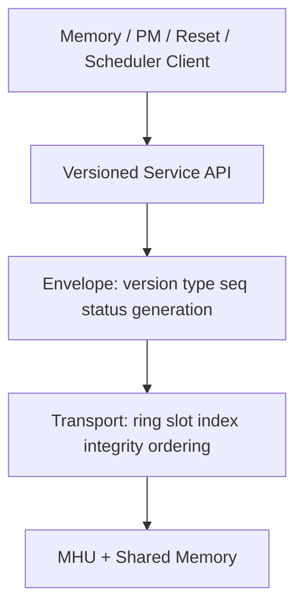

# Versioned Async Firmware Control Plane + Capability / Restart Reconciliation

## 1. 一句话定义
把 MHU/ring/shared-memory 从“消息搬运 helper”提升为可跨 FW 版本、异步请求、timeout/cancel、restart 的长期 control plane：Transport、Message Envelope、Versioned Service ABI、Capability 与 Generation 明确分层。

## 2. 背景与位置
当 FW 开始承担 init/PM/reset/scheduler/MMU 等职责，KMD↔FW 就是一个小型分布式系统。它位于底层 MHU/shared memory 与上层 Memory/Power/RAS/Virtualization service 之间。

## 3. 解决的问题
没有协议层，fw_version if/else、sequence、timeout、shared-memory ownership、stale completion、restart recovery 会散落到各模块；一次 FW ABI 升级会迫使所有 Owner 理解 raw message。

## 4. 典型场景
boot capability negotiation；异步 PM/reset command；FW crash mid-request；FW upgrade 后 service field 变化；shared ring corruption；reset 后旧 completion 晚到。

## 5. 核心对象
transport ring/slot/index、doorbell、message header、service namespace/version、seq、status/error、capability set、FW generation、device recovery generation、shared-region owner/readiness。

## 6. 分层与控制流

boot→transport init→HELLO/version/capability→service ready→async request/complete→timeout/cancel；restart 时 generation++→transport reinit→re-handshake→service reconciliation。

## 7. 边界
Transport 只保证 bytes/ordering/integrity；Envelope 负责 request identity/error/generation；Service 负责语义与 version translation；上层 Owner 只消费稳定 service API，不解析 raw FW ABI。

## 8. 生命周期
OFFLINE → TRANSPORT_READY → NEGOTIATING → SERVICES_READY → QUIESCING → RESTARTING → NEGOTIATING；失败进入 FAILED。每个 async request 绑定 fw_generation + recovery_generation。

## 9. 难点
ring producer/consumer ownership、memory ordering/cache coherency、seq wrap/reuse、FW crash mid-write、restart stale completion、backward compatibility、service dependency、timeout 后 request 是否仍可能执行。

## 10. Failure / Debug
transport corruption 与 service error 必须分层；记录 ring index、seq、service/opcode、generation、timeout/cancel、FW reset reason。Transport integrity 失败时不得继续信任 upper message fields。

## 11. 最小闭环
boot handshake→version/capability→async request/completion→timeout/cancel→restart generation→re-handshake→state reconciliation；用两个 mock FW version 验证同一 KMD service API。

## 12. 3–6 月
定义 wire/envelope；ring ordering/integrity；service registry/capability；async request table；restart/reconciliation；fault injection。

## 13. 1–2 年
FW-centric PM/reset/HW scheduler、upgrade/rollback、health/auth、virtualization admin service、service-level compatibility matrix。

## 14. Cross-Owner
Memory/RAS/Power/Virtualization 是 service client；Observability 统一 request/event identity；RAS 提供 recovery generation；Multi-GPU 未来可能消费 fabric FW service。

## 15. Upstream / Vendor 索引
Nova r000 GSP ABI migration是很好的案例：先建立兼容 abstraction，再切换新的 FW provider/ABI；Nova core/DRM 分层也体现 lower control layer 与 upper driver 的边界。

## 16. Hardware Gates
MHU/ring 并发能力？cache coherency？doorbell loss/retrigger？FW restart scope？shared memory 是否保留？boot ROM/secure FW version negotiation？哪些 service 在 QUIESCING 仍允许调用？