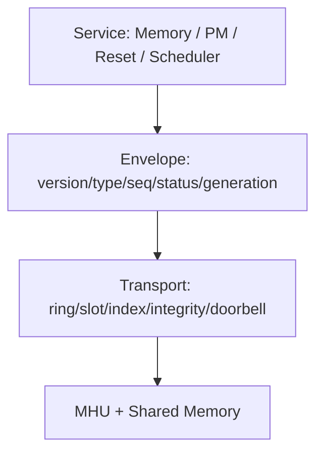

# Versioned Async Firmware Control Plane + Capability / Restart Reconciliation

## 一句话定义
把 MHU/ring/shared-memory 从“能收发消息的 helper”提升为有 transport、message envelope、service ABI、sequence、timeout/error、capability、generation 与 restart reconciliation 的长期控制面。

## 为什么需要
FW 一旦承担 init/PM/reset/scheduler/MMU 等职责，KMD 与 FW 就形成跨版本、异步、可重启的分布式状态机。没有显式 protocol contract，fw_version 判断、timeout、stale completion 和 ownership 会散落到每个模块。

## 分层

## 核心对象
transport queue、message header、service namespace、request sequence、capability set、FW generation、device recovery generation、shared region owner、readiness state。

## 第一版闭环
boot handshake→version/capability negotiation→async request/completion→timeout/cancel→restart generation→re-handshake→state reconciliation；transport integrity failure 不解析不可信的 upper RPC fields。

## 难点
ring ownership/memory ordering、FW crash mid-request、sequence wrap/reuse、restart stale completion、shared-memory coherency、service dependency、backward compatibility。

## 3–6 月 / 1–2 年
3–6 月完成 versioned async protocol 与 restart；后续 FW-centric PM/reset/HW scheduler、upgrade/rollback、health/auth、virtualization admin service。

## 原文索引
- Nova driver architecture: https://dri.freedesktop.org/docs/drm/gpu/nova/index.html
- Nova r000 GSP ABI v3: https://patchew.org/linux/20260918010719.1176945-1-jhubbard%40nvidia.com/
- Nova FWSEC: https://docs.kernel.org/gpu/nova/core/fwsec.html
