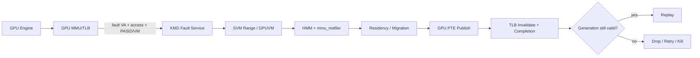
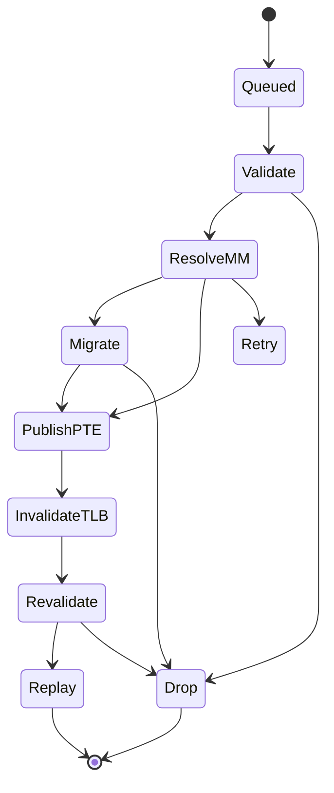

# Recoverable GPU Fault + HMM/SVM + Migration + Replay

## 1. 一句话定义
GPU 访问某个当前没有有效 GPU translation/residency 的 VA 时，不直接终止 workload，而由 KMD 联合 Linux MM/HMM 恢复 backing page、必要时迁移数据、发布 GPU PTE、完成 TLB ordering，并安全 replay 原访问。

## 2. 它在 GPU/KMD 栈中的位置
基础 GPUVM 解决“已有映射怎样翻译”；recoverable fault 解决“映射暂时不存在、页不在合适位置、或 CPU 页表变化后怎样恢复”。它位于 GPU MMU fault packet 与 Linux MM/HMM、GPUVM/PTE/TLB、DMA migration、FW replay 之间，是 Unified Memory 从静态 pin/map 走向 demand paging 的核心控制面。

## 3. 为了解决什么问题
没有 recoverable fault，UMD 往往必须在 dispatch 前把 working set 全部 pin/map 到 GPU，显存超额、按需迁移、CPU/GPU shared VA、进程地址变化和 multi-GPU UVM 都很难成立。真正目标不是“写一个 fault ISR”，而是建立一个可恢复的地址访问协议：fault 只是触发器，最终必须闭合到 MM validity、residency、PTE publication、TLB visibility 与 replay。

## 4. 典型场景
- GPU 首次访问 CPU malloc/mmap 的共享地址，GPU PTE 尚不存在。
- 页面当前在 system memory，需要映射或迁移到 VRAM。
- VRAM oversubscription 后页面被 evict，后续访问再次 fault-in。
- CPU munmap/mprotect/COW 与 GPU fault/migration 并发。
- GPU reset/FW restart 发生在 fault worker、migration DMA 或 replay 途中。
- 未来 multi-device：同一 logical range 在 GPU0/GPU1 有不同 residency/mapping state。

## 5. 核心对象与术语
**SVM range** 是逻辑 VA 范围；**CPU page** 是 Linux MM backing；**migration unit** 是搬运粒度；**GPU PTE unit** 是页表表示粒度；**TLB invalidate unit** 是硬件失效粒度。这五者必须解耦。另有 PASID/VMID、GPU VM、fault packet、HMM snapshot、mmu_notifier_seq、residency state、context generation、recovery generation 与 replay token。

## 6. 端到端控制流
1. HW 产生 fault packet，至少带 VA/access type/VM 或 PASID identity。
2. KMD 定位 GPUVM/SVM range，并先验证 context、VM、recovery generation。
3. 进入 device-I/O admission domain，防止“检查 healthy 后 reset 才开始”的 TOCTOU。
4. HMM/MM 查询 CPU mapping、permission 与 backing page，并与 mmu_notifier invalidation 协调。
5. 决定 direct system-memory mapping、page migration 或拒绝访问。
6. 如需 migration，DTE/DMA 搬运完成后再发布 GPU PTE。
7. 发出 TLB invalidation，等待架构要求的 completion/ordering point。
8. 再验证 notifier/VM/context/recovery generation。
9. FW/HW replay service ready 且所有 generation 仍匹配才 replay，否则 drop/retry/kill。

## 7. HW / FW / KMD / UMD / Linux MM 边界
HW 负责 fault detect、packet、PTE/TLB/replay primitive；FW 可负责 fault queue、replay command、TLB service，但不拥有 Linux page lifetime policy；KMD 拥有 range/residency/migration/PTE publication 与 race correctness；Linux MM/HMM 是 CPU VA/PTE/page lifetime 的权威；UMD 负责 allocation/advice/prefetch 等 policy hint，不应自行绕过 KMD/MM correctness。

## 8. 生命周期与状态机

## 9. 最难的 correctness / race / lifetime / performance
第一难点是异步生命周期：munmap/mprotect/process exit/context destroy/reset/FW restart 都可能让“刚才正确”的结果失效，所以一次入口检查不够。建议至少区分 mmu_notifier_seq、vm_generation、context_generation、recovery_generation。第二难点是粒度解耦。第三是 backpressure/fault storm。第四是硬件循环依赖：如果 faulting traffic 占满 L1 TLB MSHR，而用于解 fault 的 DTE PA transaction、页表更新或 migration 仍必须申请同一稀缺 MSHR，就可能死锁；硬件必须明确 PA/bypass transaction 是否需要 translation miss state、是否有 reserved MSHR/escape path、page-table update/DMA 是否可走独立通道。

## 10. 失败模式与 Debug / Observability
必须区分 invalid VA、permission、OOM/migration failure、TLB timeout、stale generation、device blocked、FW replay timeout、fault storm。trace 至少记录 fault_id、PID/PASID、VM/context、range、VA/access、residency before/after、migration bytes/time、PTE publish time、tlb_issue_time、tlb_completion_time、replay/drop reason、recovery_generation。

## 11. 第一版最小能力闭环
单 GPU、单进程、fault-driven；4K correctness 但数据模型不绑定 4K；HMM lookup；system memory↔VRAM migration；PTE publish + TLB completion + replay；覆盖 invalidation/process teardown/context destroy/reset race；可观测每个阶段 latency/retry/drop reason。

## 12. 3–6 月实施
0–1 月：对象、锁、generation、fault schema、HW capability review。1–2 月：fault→HMM→PTE/TLB→replay。2–3 月：migration。3–4 月：munmap/mprotect/exit/context destroy/reset race。4–6 月：fault storm、memory pressure、reset injection、latency/throughput measurement。

## 13. 1–2 年演进
large/compound page、prefetch、oversubscription/reclaim、NUMA/tiered memory、multi-device per-range state、multi-GPU UVM、ATS/PRI/PASID/SVA 与 CXL memory。

## 14. 与其它 Owner 的接口
RAS 提供 admission/recovery generation；Firmware 提供 fault/replay/TLB service readiness；Multi-GPU 提供 peer reachability/topology generation；Observability 提供 stable identity/timeline；Power 必须保证 fault/migration critical path 的 PM lifetime；Virtualization 提供 PASID/IOMMU/tenant isolation。

## 15. Upstream / Vendor 案例与原文索引
- XDC 2026 DRM SVM：range、native large page、fault/non-fault、multi-device。
- Linux HMM：CPU MM 与 device memory mirroring/migration 的 canonical model。
- AMDGPU/KFD SVM 与 Xe SVM/GPUVM：用于比较 fault-driven、range model 与 driver/MM synchronization。

## 16. Open Questions / HW Gates
fault packet identity 是否足够？fault replay 粒度？DTE PA path 是否绕过 translation MSHR？是否有 reserved escape resource？TLB completion 如何观测？active engine 下能否安全改 PTE/migrate？fault queue overflow 行为？reset 后 fault packet 是否携带 generation？