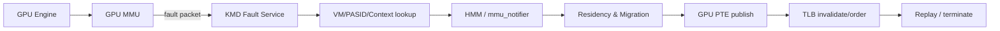
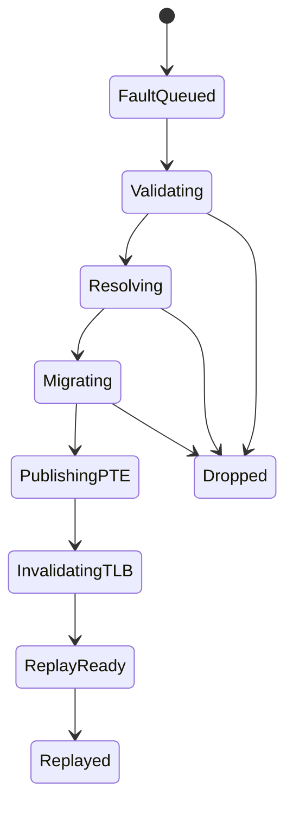

# Recoverable GPU Fault + HMM/SVM + Migration + Replay

## 一句话定义
当 GPU 访问一个当前不可访问、尚未驻留或映射已失效的虚拟地址时，不直接杀死 workload，而是由 KMD 与 Linux MM 协同恢复页面、建立 GPU 映射、完成必要 TLB ordering，最后安全 replay faulting work。

## 为什么需要
基础 GPUVM 只能回答“VA 如何翻译成 PA/IOVA”；Unified Memory 要进一步回答“目标页现在不在 GPU 可访问位置时怎么办”。没有 recoverable fault，UMD 必须提前 pin/map 全部 working set，难以支持超额显存、按需迁移、CPU/GPU 共享地址和未来 multi-GPU UVM。

## 栈中位置

## 核心对象
SVM range、GPU VM、PASID/VMID、fault packet、mmu_notifier sequence、residency state、migration unit、GPU PTE、TLB invalidation、context generation、recovery generation。

## 端到端控制流
1. HW 产生 fault，packet 至少携带 VA、access type、VM/PASID/context identity。
2. KMD 找到逻辑 SVM range，验证 VM/context/recovery generation。
3. 与 Linux MM/HMM 协同确认 CPU page 和访问权限；并与 mmu_notifier invalidation 串行化。
4. 决定页面留在 system memory、迁移到 VRAM，或建立可直接访问的 system-memory mapping。
5. 完成 DMA/migration 后发布 GPU PTE。
6. 发出 TLB invalidate，并等待架构要求的 completion/ordering point。
7. 再验证 generation；只有仍属于当前 VM/context/device world 才 replay。

## 最难的问题
**Race correctness** 是第一难点，不是 HMM API 本身。munmap/mprotect/COW/process exit/context destroy/GPU reset/FW restart 都可能发生在 fault service 中途。第二难点是粒度：fault range、CPU page、migration batch、GPU PTE 和 TLB invalidate unit 不应被强行绑定成 4K。第三是 deadlock：用于解 page fault 的 DMA/PTE update 路径不能依赖已被 faulting traffic 耗尽的 translation/MSHR 资源。

## 生命周期与状态

## 第一版最小闭环
单 GPU、单进程；fault-driven；4K correctness 但数据模型不绑定 4K；HMM lookup；system↔VRAM migration；PTE/TLB/replay；覆盖 invalidation、teardown、reset-generation race；提供 fault latency、migration latency、TLB latency、drop/retry reason telemetry。

## 3–6 月
0–1 月定义对象/锁/generation；1–2 月打通 fault→HMM→PTE→replay；2–3 月加入 migration；3–4 月加入 notifier/teardown/reset race；4–6 月 fault injection、压力测试、measurement contract。

## 1–2 年
range/large page、oversubscription/reclaim、multi-device per-range state、multi-GPU UVM、NUMA/tiered memory、ATS/PRI/SVA integration。

## 边界
Memory Owner 决定 residency/mapping/replay correctness；RAS 提供 device admission/recovery generation；Firmware 提供 fault/replay protocol 与 readiness；Multi-GPU 提供 peer reachability；Observability 提供稳定 identity/timeline；Power 不能在 fault critical path 中错误 suspend device；Virtualization 提供 PASID/VM/resource isolation。

## 原文索引
- Linux GPU SVM RFC: https://docs.kernel.org/gpu/rfc/index.html
- Linux HMM: https://docs.kernel.org/mm/hmm.html
- AMDGPU GPUVM: https://origin.kernel.org/doc/html/latest/gpu/amdgpu/driver-core.html
- XDC 2026 DRM SVM talk: https://indico.freedesktop.org/event/12/timetable/?view=standard

## Open Questions / HW Gates
fault packet 能否精确关联 PASID/VM/context？replay 粒度是什么？DTE/页表更新是否绕过 faulting translation resource？TLB invalidate completion 如何观察？是否支持 page migration while engines active？