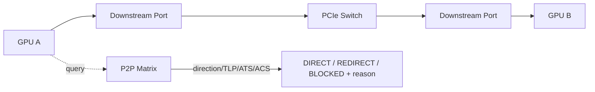

# Multi-GPU Topology & Directional/TLP-aware P2P Capability Matrix

## 一句话定义
为每对 GPU 建立稳定身份、PCIe/NUMA topology，并针对方向和 TLP class 判断 peer transaction 是 direct、redirected 还是 blocked，同时给出可诊断原因。

## 为什么需要
“同一个 PCIe switch”不等于 P2P 可用。ACS Request/Completion Redirect、Translation Blocking、ATS、IOMMU、Address Type、Relaxed Ordering 都可能改变某一类 transaction 的可达性，而且 A→B 与 B→A 不一定等价。

## 架构

## 核心对象
stable GPU ID、PCI path、NUMA node、direction、Request Address Type、Completion class、ACS bits、ATS mode、IOMMU mode、peer BAR/PTE capability。

## 第一版闭环
enumeration→topology walk→A→B/B→A→TLP-class evaluation→reason code→debugfs/internal query→真实 peer BAR/DMA validation。

## 难点
nested/asymmetric switches、per-device vs per-mapping ATS、IOMMU translation、hot reset/topology generation、peer mapping revoke。

## 3–6 月 / 1–2 年
3–6 月完成 topology/capability/reason matrix；后续 peer BAR/PTE、dma-buf P2P、fabric health、shared VM/multi-GPU UVM。

## 原文索引
- PCI/P2PDMA v9, 18 patches: https://lwn.net/Articles/1098081/
- Linux PCI P2P DMA docs: https://docs.kernel.org/driver-api/pci/p2pdma.html
