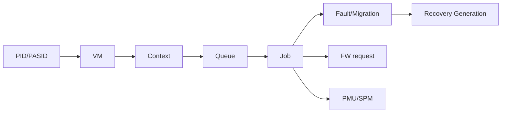

# Stable GPU Object/Event Identity + eBPF KMD Trace

## 一句话定义
先给 device/client/PID/PASID/VM/context/queue/job/fault/migration/FW request/reset 建立稳定关联 ID，再让 tracepoint/eBPF/PMU/SPM/crash snapshot 共享同一套关联语义。

## 为什么需要
只有散乱 printk 或函数级 kprobe 时，可以看到“发生了事件”，却难以回答“这是哪个进程、哪个 VM、哪条 queue、哪个 job，在 reset 前后发生了什么”。稳定 identity 是跨 UMD/KMD/FW/GPU timeline 的公共键。

## 数据模型

## 第一版闭环
定义稳定 ID/schema；关键 lifecycle tracepoint；eBPF CO-RE consumer；software counters；reset generation correlation；基础 timeline exporter。

## 难点
ID reuse、对象销毁后事件、低开销、ABI/schema stability、timestamp domain 对齐、敏感数据暴露、PMU attribution。

## 3–6 月 / 1–2 年
先 software trace/eBPF，再接 PMU/SPM、per-process profiling、UMD/FW timestamp correlation、dynamic diagnostics/programmable hooks。

## 原文索引
- AMDGPU profiler UAPI discussion: https://www.mail-archive.com/amd-gfx%40lists.freedesktop.org/msg151914.html
- DRM usage stats: https://docs.kernel.org/gpu/drm-usage-stats.html
