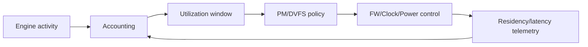

# GPU Utilization Accounting → Runtime PM / DVFS

## 一句话定义
先建立可信的 GPU busy/idle、频率驻留和 PM lifetime 观测，再据此安全地让 GPU/engine 进入低功耗状态并进行 DVFS。

## 为什么需要
“能关电”不是 Power Owner 的起点。没有正确 utilization 与 lifetime，runtime suspend 可能发生在 fault worker、FW request、telemetry 或 queue 仍需访问硬件时；错误的 governor measurement 又会让 DVFS policy 无法验证。

## 数据流

## 第一版闭环
per-engine busy/idle；active reference/lifetime；runtime suspend/resume；quiesce/drain；transition latency；frequency residency。DVFS policy 后置。

## 难点
异步 worker lifetime、nested PM refs、reset/suspend 并发、FW readiness、PCIe D-state、clock/power domain dependency、measurement 与真实硬件 residency 不一致。

## 3–6 月 / 1–2 年
先 measurement + runtime PM；再 DVFS/OPP、thermal/power cap、memory-bandwidth feedback、per-workload QoS。

## 原文索引
- Linux Runtime PM: https://docs.kernel.org/power/runtime_pm.html
- Xe driver docs: https://docs.kernel.org/gpu/xe/
