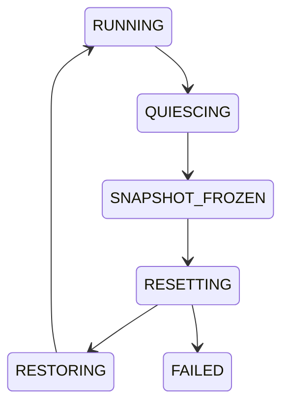

# GPU Recovery Admission + Snapshot + Reconciliation

## 一句话定义
GPU hang/error 后先冻结证据并关闭新的硬件访问，drain 已进入的访问者，再执行 reset，并用 generation 与 reconciliation 建立一个一致的新 device world。

## 为什么需要
仅有 watchdog + reset 会丢失根因证据，并留下最危险的竞态：旧 fault/FW/MMIO worker 在 reset 过程中继续碰硬件，或 reset 前发出的 completion 在 reset 后被当成当前结果。

## 状态机

## 三个必须分开的概念
Admission Gate 回答“现在能否碰硬件”；Recovery Generation 回答“这个异步结果是否仍属于当前 device world”；Reconciliation 回答“reset 后哪些 SW/FW/HW state 必须重建”。

## 第一版闭环
heartbeat/watchdog→frozen snapshot/devcoredump/FW log/reset reason→publish blocked→close admission→drain→advance generation→full reset→global state reconcile→health/reopen。

## 难点
snapshot 与 destructive reset ordering、submission/ioctl/fault/FW worker/remove 并发、reset coalescing、stale completion、partial reset scope、failed recovery 的 terminal state。

## 原文索引
- Xe device I/O isolation v2: https://www.mail-archive.com/dri-devel%40lists.freedesktop.org/msg638225.html
- Xe device I/O SRCU patch: https://www.mail-archive.com/dri-devel%40lists.freedesktop.org/msg638180.html
- VFIO PCI error recovery v2: https://lwn.net/Articles/1097488/
- Xe device coredump docs: https://docs.kernel.org/gpu/xe/
