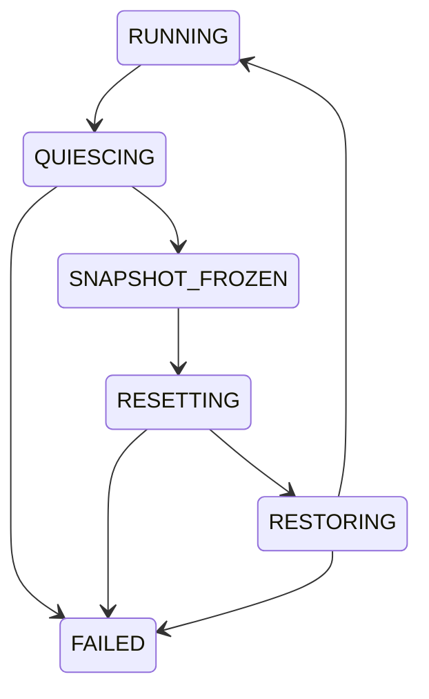

# GPU Recovery Admission + Snapshot + Generation + Reconciliation

## 1. 一句话定义
GPU hang/error 后，先冻结可用于定位根因的证据，阻止新的危险硬件访问并 drain 已进入访问者，再 reset；reset 后用 generation 丢弃旧世界异步结果，并显式重建 SW/FW/HW state。

## 2. 背景与位置
watchdog/reset 只是 recovery 的两个端点。完整 RAS control plane 位于 hang detector、submission/fault/FW/MMIO users、PCI/AER、snapshot/devcoredump 与 device re-init 之间。

## 3. 解决的问题
单一 `resetting=true` 无法关闭 check-then-access race；直接 reset 会破坏证据；旧 FW completion/fault worker 可能穿越 reset；reset 后软件认为存在的 queue/VM 与硬件实际状态可能不一致。

## 4. 典型场景
engine hang；FW crash；PCI AER；page-fault worker 与 reset 并发；VRAM CPU mapping 在 permanent wedge 后仍可能触碰设备；remove/suspend 与 recovery 并发。

## 5. 核心对象
health state、admission gate、reader domain、snapshot generation、recovery generation、reset scope、reset reason、reconciliation plan、stale async completion。

## 6. 控制流
Detect → Freeze Evidence → Publish Blocked → Close Admission → Drain Readers → Select Reset Scope → Advance Generation → Reset/Isolate → Reconcile → Validate → Publish Health → Reopen。

## 7. 边界
RAS 拥有 recovery lifecycle；Memory/FW/Power/Virtualization 等所有 hardware-touching path 必须消费 gate/generation contract；各 Owner 自己决定本域 state 如何 reconcile。

## 8. 状态机

## 9. 最难的问题
Admission Gate、Generation、Health State 不能混为一个 bool。Gate 解决“此刻能否进入硬件访问”；generation 解决“异步结果属于哪个 device world”；health 是对外状态。还要避免 recovery 自己等待持有 gate 的 worker，而 worker 又等待 recovery resource 的死锁。

## 10. Failure / Debug
frozen snapshot 必须早于 destructive reset；记录 reason、engine/queue/job、FW logs、MMIO snapshot、admitted-reader count、drain latency、reset scope、generation、restore failure。permanent wedge 与 temporary recovery 必须有不同错误语义。

## 11. 最小闭环
heartbeat/watchdog → frozen snapshot/devcoredump → device-wide admission gate → drain → full reset → generation advance → global state reconcile → health event/reopen。

## 12. 3–6 月
枚举所有 hardware-touching path；实现 device-wide gate；接 submission/fault/FW/MMIO；snapshot；full reset/reconcile；fault injection matrix。

## 13. 1–2 年
device→engine→queue/context hierarchical recovery；partial reset；job replay；ECC/bad-page retirement；fabric health；predictive RAS。

## 14. Cross-Owner
Memory/FW 消费 generation；Power 与 RAS 共享 quiesce；Virtualization 复用 reset/isolation primitive；Multi-GPU 需要 fabric/device generation；Observability 提供 pre/post-fault timeline。

## 15. Upstream 索引
Xe wedge isolation v2（15 patches）展示 common DRM SRCU I/O gate；VFIO PCI error recovery v2（16 patches）展示 host recovery + userspace state/sequence notification。

## 16. Hardware Gates
reset scope 有哪些？reset 是否破坏 VRAM？FW/engine 能否独立 reset？interrupt/DMA 如何彻底 quiesce？bus mastering/PCI state 如何配合？哪些 snapshot register 在 hang 后仍安全可读？