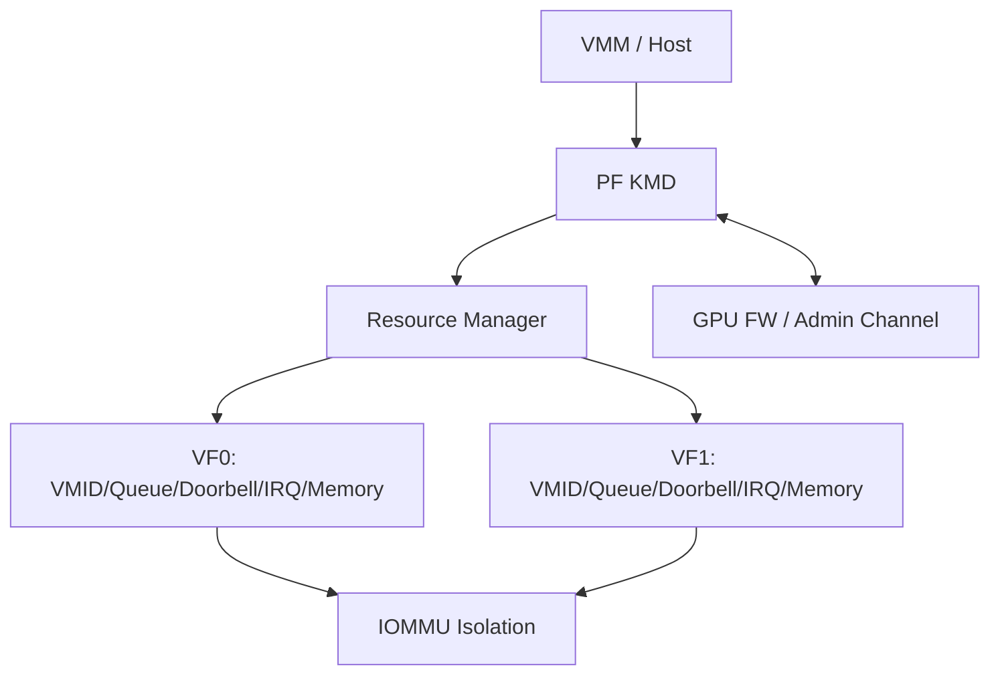

# SR-IOV PF/VF Provisioning & Isolation

## 一句话定义
由 PF KMD 把一块物理 GPU 的可分配资源安全、可恢复地切分给多个 VF，并确保 VF 只能访问被授予的 VMID、queue、doorbell、interrupt、memory 与 engine 资源。

## 为什么需要
PCIe SR-IOV 只创建 PF/VF function，并不会自动解决 GPU 内部资源隔离。真正困难的是 GPU-specific provisioning、PF↔VF ABI、IOMMU/PASID、FLR 后状态恢复和资源 accounting。

## 架构

## 核心挑战
资源 capability 不对称；PF/VF lifecycle；VF FLR 与 PF global reset 的边界；PF↔VF protocol version；restore blob 不可信输入验证；DMA/IOMMU isolation；reset 时 stale completion。

## 第一版闭环
先做 hardware capability matrix。只有 ASIC/FW 真正支持 SR-IOV 时，才实现 PF enable→VF resource allocate→VF probe→basic workload→VF FLR→resource reclaim。每个资源显式记录 present/assigned/initialized/active/resettable/migratable。

## 3–6 月 / 1–2 年
3–6 月聚焦 provisioning/isolation/FLR；后续扩 PF-VF versioned admin channel、live migration、vGPU partition、secure boot/measurement/attestation。

## 原文索引
- VFIO PCI error recovery RFC v2: https://lwn.net/Articles/1097488/
- Linux VFIO docs: https://docs.kernel.org/driver-api/vfio.html
